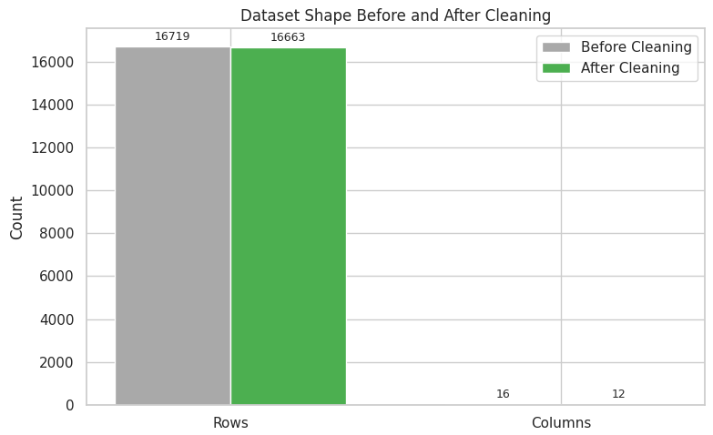
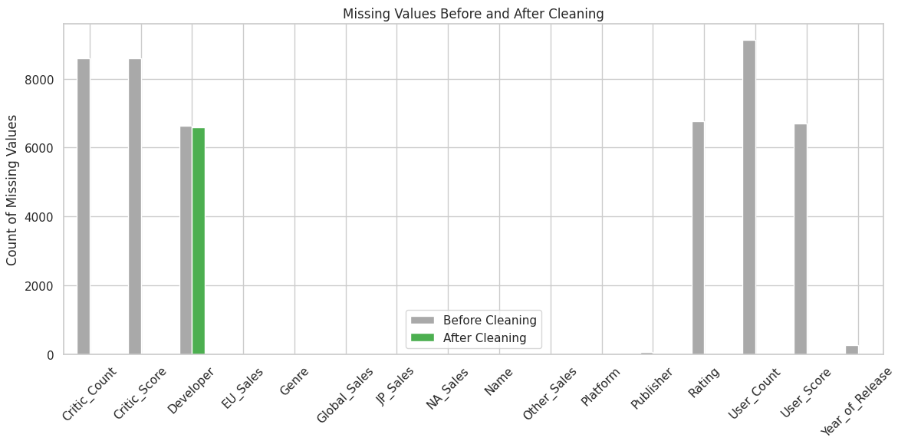
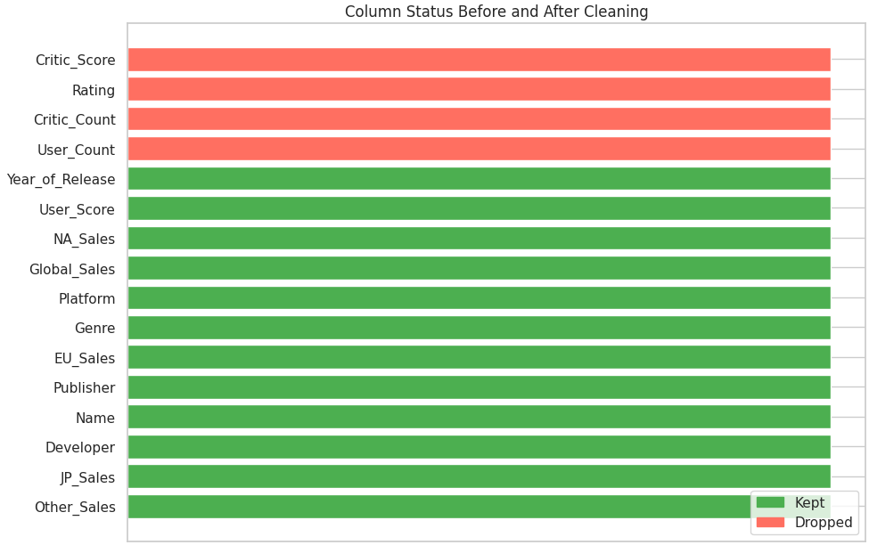
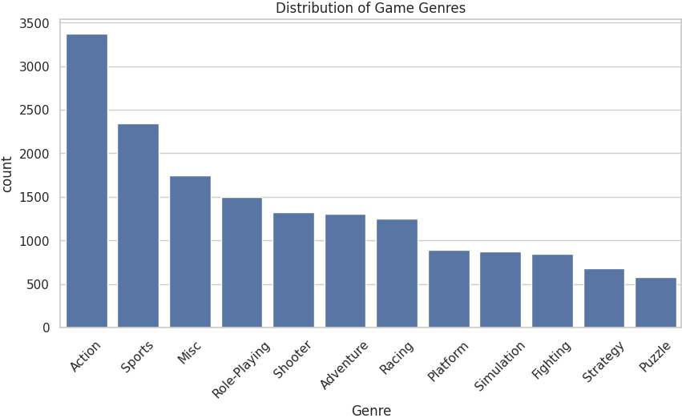
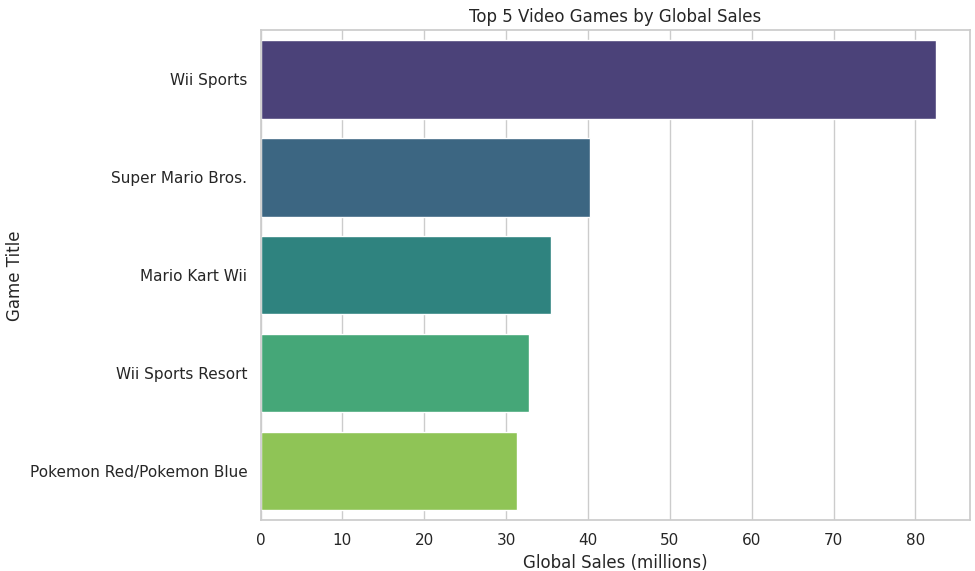
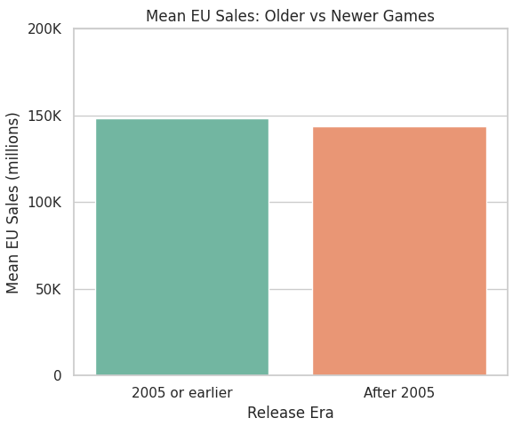
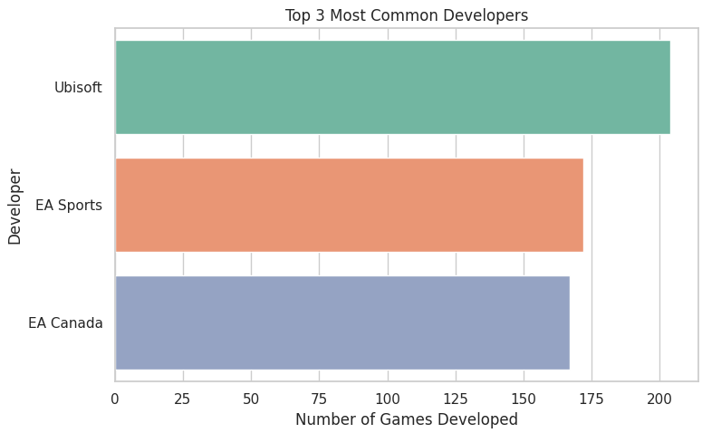
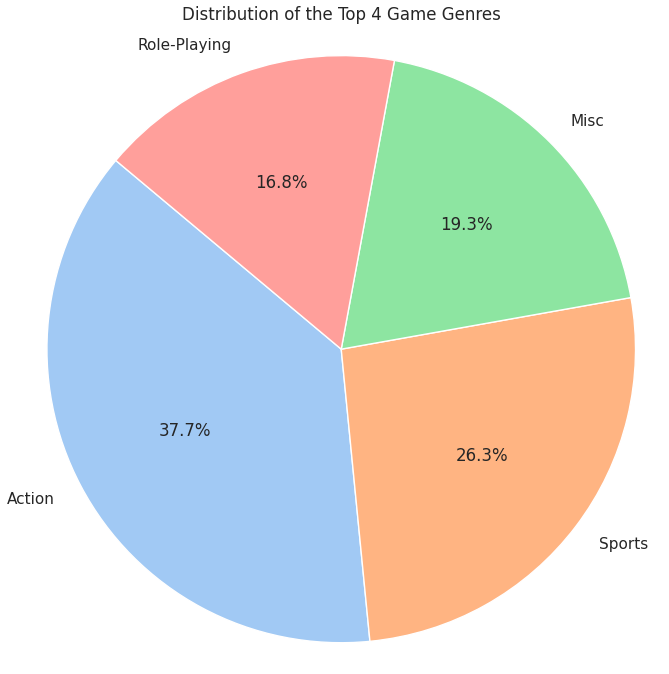
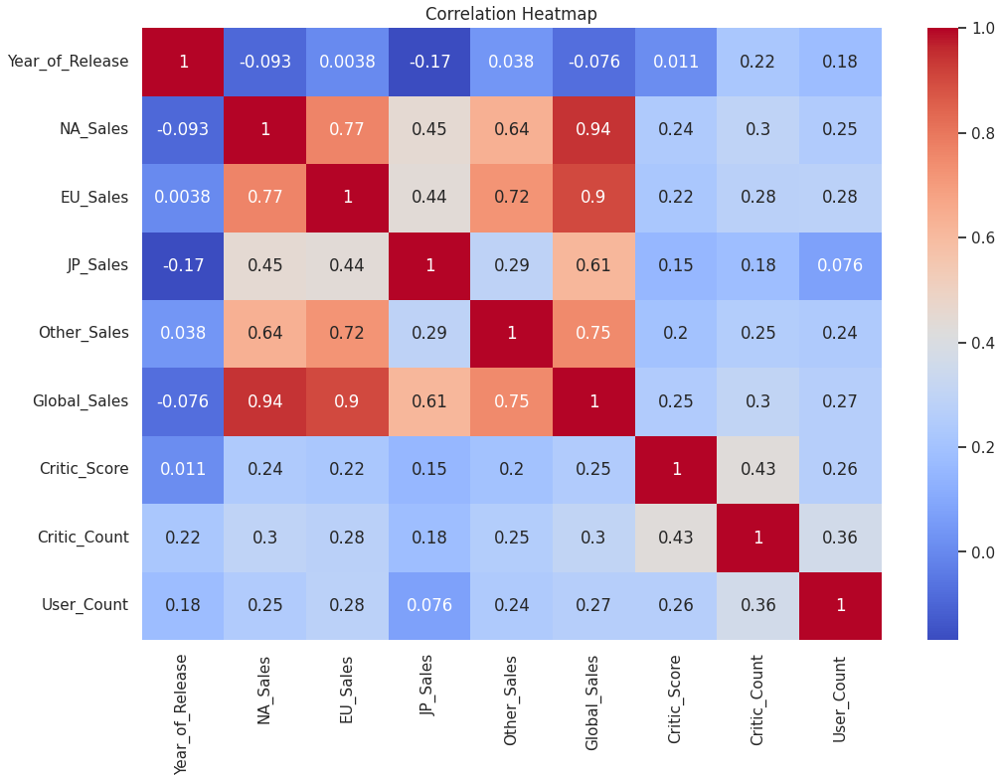
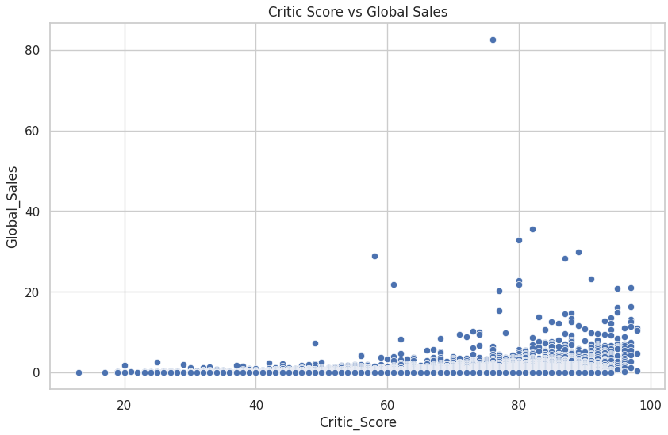

# 🔢 Video Game Sales Data Visualisation

## 📊 Project Overview

This project focuses on data cleaning and visualisation using a dataset of video game sales from various global regions. It was carried out as part of a data visualisation assessment for the Data Analytics Specialisation.

The goal was to:

- Clean and preprocess the dataset
- Identify and handle missing values
- Explore patterns in regional/global sales
- Create meaningful visualisations using Matplotlib and Seaborn

---

## 🗂️ Folder Structure

```bash
CA1_DATA_VISUALISATION/
├── vgSales.csv
├── DataVisualisationCA.ipynb
├── README.md
└── images/
    ├── beforevsafterclean.png
    ├── correlation_heat.png
    ├── criticscore_globalsales.png
    ├── datashape.png
    ├── EU_Means.png
    ├── game_distribution.png
    ├── global_sales.png
    ├── missing_values.png
    ├── top_3.png
    ├── top4.png
    └── user_score.png
```

---

## 📁 Dataset Summary

- **File**: `vgSales.csv`
- **Rows**: 16,598 entries before cleaning
- **Columns**: 11 attributes
- **Context**: Global sales data across North America (NA), Europe (EU), Japan (JP), and others, including critic/user scores.

---

## 📊 Libraries Used

```python
# Core libraries
import pandas as pd
import numpy as np

# Visualization
import matplotlib.pyplot as plt
import seaborn as sns

# Display settings
import warnings
warnings.filterwarnings('ignore')

# Show plots inside notebook
%matplotlib inline

# Style
sns.set(style="whitegrid")

# Calculate means for visualisation
from numpy import mean
import matplotlib.patches as mpatches
```

---

## 🔎 Data Cleaning and Preparation

### 📆 Dataset Shape

Before proceeding, we examined the original shape of the data:



### ❌ Missing Values

We identified and visualised missing data:



### 🌐 Before vs After Cleaning

A comparison of the dataset before and after null values and irrelevant entries were removed:




---

## 🌈 Exploratory Visualisation

### 🔹 Game Distribution

Visualisation of game frequency by genre:




### 🌎 Global Sales Distribution



### 🇩️🇪 EU Mean Sales by Genre



### 🔹 Top 3 Selling Genres



### 🔹 Top 4 Selling Publishers (All Time)



### 🔹 Correlation Heatmap

Correlation between scores and global sales:



---

## 🏋️️ Critic & User Score Analysis


### 🌟 Critic Score vs Global Sales



### ⭐️ User Score Distribution


---

## 📊 Conclusion

- Most sales are dominated by action, sports, and shooter genres.
- EU and NA lead in regional sales; Japan is lower.
- Critic score has moderate correlation with global sales, more so than user score.
- The dataset required some cleaning, especially handling missing values and filtering genres/publishers.

---
